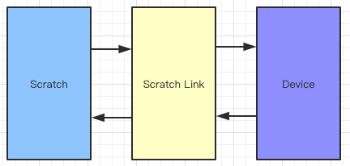
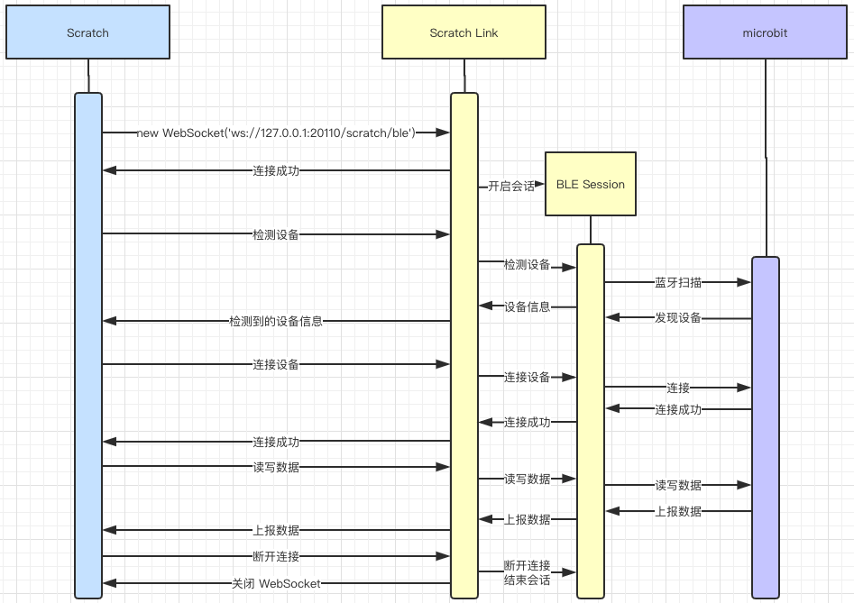

# scratch-node-link
使用 nodejs 模拟 scratch-link 实现硬件连接通讯

### 使用方法
```bash
git clone https://github.com/Micircle/scratch-node-link.git
npm i
npm start
```
将 ```scratch-gui/node_modules/scratch-vm/src/util/scratch-link-websocket.js``` 中

```javascript
this._ws = new WebSocket('wss://device-manager.scratch.mit.edu:20110/scratch/ble');
```
改为
```javascript
this._ws = new WebSocket('ws://127.0.0.1:20110/scratch/ble');
```
就可以连接 microbit 了

Windows 如果 npm 安装依赖失败，请查看：https://github.com/noble/noble 的说明

### 以 microbit 扩展为例，了解 Scratch 硬件通讯流程
想知道 Scratch 3.0 怎么使用 micro:bit 扩展，请查看 microbit 扩展的帮助页 https://scratch.mit.edu/microbit 。本文是对 Scratch 硬件连接通讯过程的分析。

在浏览器中运行的 Scratch，无法直接与硬件设备通讯（除非使用实验中的 Bluetooth 等功能），需要一个本地服务来帮助它来实现，这就是 Scratch Link 的作用。Scratch Link 的主要功能就是与 Scratch 通讯、与硬件设备通讯。



Scratch Link 会开启一个本地 WebSocket 服务器，Scratch 通过 WebSocket 与 Scratch Link 进行连接通讯，使用 WebScoket 服务端和客户端都可以主动推送消息，想要详细了解的可以查看阮一峰老师的 《WebSocket 教程》[http://www.ruanyifeng.com/blog/2017/05/websocket.html]。

Scratch Link 会监听 Scratch 发来的连接请求，根据请求的路由来与不同的设备进行通讯，目前支持两个路由 scratch/ble 和 scrattch/bt，分别对应低功耗蓝牙和蓝牙。
Scratch Link 在接收到 Scratch 的连接请求后，双方就会建立起 socket 通道开始通讯，Scratch 会向 Scratch Link 发送命令（command） 或请求（request）如：检测设备、连接设备、向设备写入数据、读取设备数据、订阅设备信息、取消订阅、断开设备等。Scratch 也会响应（response）Scratch Link 发来的命令请求如：发现设备、设备数据更新、设备断开等。

以 microbit 为例，流程如下：
1. Scratch 会使用路由 scratch/ble 向 Scratch Link 发起连接请求。两者握手成功后建立起 WebSocket 连接。
2. Scratch Link 根据路由选择开启与低功耗设备通讯的会话 BLE Session。
3. Scratch 发起检测 microbit 设备的命令。
4. Scratch Link 接收到命令，BLE Session 开始检测设备。
5. BLE Session 发现设备，通过 WebSocket 向 Scratch 发送检测到设备的信息。
6. Scratch 接收到发现的设备，开始发送连接请求。
7. Scratch Link 接收到请求，BLE Session 开始连接设备。
8. BLE Session 连接成功，并告知 Scratch。
9. Scratch 得知连接成功，发起读取或写入请求。
10. Scratch Link 接收到请求，BLE Session 开始读取或写入数据到设备，并订阅设备的信息，在接收到信息时发送给 Scratch。
11. 断开设备时，关闭 BLE Session，关闭 WebSocket



详细实现可以查看使用 nodejs 的代码实现。

除了 ble 连接外，也可以用同样的方式实现串口 serialport 的连接通讯。
